<h1 align="center">NexusAI — Full-Stack AI Platform</h1>

<p align="center">
  
</p>


# A production-grade AI application with a memory-persistent chatbot, document Q&A (RAG), and a self-critiquing research agent — built with LangGraph, FastAPI, Pinecone, and React.

---

## What This Project Does

NexusAI gives you four AI capabilities in one unified interface:

| Feature | What it does |
|---|---|
| **Chatbot** | Conversational AI with full memory across sessions using LangGraph + Groq LLaMA 3.1 |
| **RAG** | Upload a PDF/TXT/DOCX and ask questions — answers grounded in your document |
| **Research Agent** | Searches the web (Tavily), writes a summary, then self-critiques it |
| **Critic Agent** | Scores research output on Accuracy, Completeness, Clarity, Source Usage (each /10) |

---

## System Architecture

```
┌─────────────────────────────────────────────────┐
│              React + Vite Frontend              │
│   Home  │  Chat (SSE)  │  RAG  │  Research      │
└────────────────────┬────────────────────────────┘
                     │ REST + SSE
┌────────────────────▼────────────────────────────┐
│              FastAPI Backend                    │
│                                                 │
│  ┌──────────────┐ ┌──────────┐ ┌─────────────┐  │
│  │   Chatbot    │ │   RAG    │ │   Agents    │  │
│  │  LangGraph   │ │ Pinecone │ │ Research +  │  │
│  │  SqliteSaver │ │ ingest + │ │   Critic    │  │
│  │  Groq LLaMA  │ │ retrieve │ │   Tavily    │  │
│  └──────────────┘ └──────────┘ └─────────────┘  │
│                                                 │
│         Logger  │  Config  │  Docker            │
└────────┬─────────────────────────┬──────────────┘
         │                         │
┌────────▼──────────┐  ┌──────────▼──────────────┐
│  SQLite (global)  │  │   Pinecone (cloud)      │
│  chatbot.db       │  │   384-dim vectors       │
│  all features     │  │   cosine similarity     │
└───────────────────┘  └─────────────────────────┘
```

---

## Tech Stack

| Layer | Technology |
|---|---|
| LLM | Groq — LLaMA 3.1 8B Instant |
| Orchestration | LangGraph (stateful graph + memory) |
| Vector DB | Pinecone (cloud, free tier) |
| Embeddings | HuggingFace all-MiniLM-L6-v2 (local, free) |
| Web Search | Tavily API |
| Backend | FastAPI + Python 3.12 |
| Memory | SQLite (global) + SqliteSaver (LangGraph) |
| Frontend | React 18 + Vite + CSS Modules |
| Streaming | Server-Sent Events (SSE) |
| Testing | Pytest + unittest.mock — 37 tests |
| Logging | RotatingFileHandler (5MB × 3 backups) |
| Container | Docker (multi-stage) + docker-compose |

---

## Project Structure

```
project/
├── backend/
│   ├── app/
│   │   ├── main.py                  # FastAPI app + lifespan
│   │   ├── api/
│   │   │   ├── routes.py            # All endpoints
│   │   │   └── schemas.py           # Pydantic models
│   │   ├── chatbot/
│   │   │   ├── state.py             # ChatState TypedDict
│   │   │   ├── graph.py             # LangGraph + SqliteSaver
│   │   │   ├── nodes.py             # chat_node
│   │   │   └── service.py           # invoke + stream
│   │   ├── rag/
│   │   │   ├── ingest.py            # Load → chunk → embed → Pinecone
│   │   │   ├── retriever.py         # Pinecone similarity search
│   │   │   ├── rag_chain.py         # LLM answers from context
│   │   │   └── rag_service.py       # Public entry points
│   │   ├── agents/
│   │   │   ├── research_agent.py    # Tavily + LLM summarise
│   │   │   ├── critic_agent.py      # Score /10 + JSON output
│   │   │   └── agent_pipeline.py    # Research → Critic loop
│   │   ├── database/
│   │   │   └── sqlite_db.py         # Global shared SQLite
│   │   ├── config/settings.py       # All env vars
│   │   ├── logger/logger.py         # Console + file logging
│   │   └── utils/helpers.py         # Utilities + decorators
│   ├── tests/                       # 37 pytest tests
│   ├── logs/                        # Auto-created at runtime
│   ├── Dockerfile                   # Multi-stage build
│   └── requirements.txt
│
├── frontend/
│   ├── src/
│   │   ├── App.jsx                  # Root + page router
│   │   ├── context/ChatContext.jsx  # Global state
│   │   ├── services/api.js          # All API calls + SSE
│   │   ├── components/
│   │   │   ├── Sidebar.jsx          # Nav + thread history
│   │   │   └── MessageBubble.jsx    # Markdown message renderer
│   │   └── pages/
│   │       ├── Home.jsx             # 2×2 feature card grid
│   │       ├── Chat.jsx             # Streaming chat UI
│   │       ├── RAG.jsx              # Upload + Q&A
│   │       └── Research.jsx         # Agent + critic scores
│   ├── vite.config.js               # Proxy /api → :8000
│   └── package.json
│
├── data/
│   ├── raw/                         # Uploaded documents
│   └── processed/
├── docker-compose.yml
└── .gitignore
```

---

## Getting Started

### Prerequisites

- Python 3.12+
- Node.js 18+
- API keys for: [Groq](https://console.groq.com) · [Pinecone](https://pinecone.io) · [Tavily](https://app.tavily.com)

### 1. Clone the repo

```bash
git clone https://github.com/your-username/nexusai.git
cd nexusai
```

### 2. Backend setup

```bash
cd backend

# Create and activate virtual environment
python -m venv venv
venv\Scripts\activate          # Windows
source venv/bin/activate       # Mac/Linux

# Install dependencies
pip install -r requirements.txt

# Add your API keys
cp .env.example .env
# Edit .env with your keys
```

### 3. Configure `.env`

```env
GROQ_API_KEY=your_groq_key
GROQ_MODEL=llama-3.1-8b-instant
SQLITE_DB_PATH=chatbot.db
PINECONE_API_KEY=your_pinecone_key
PINECONE_INDEX_NAME=rag-index
EMBEDDING_MODEL=sentence-transformers/all-MiniLM-L6-v2
RAG_TOP_K=4
TAVILY_API_KEY=your_tavily_key
```

### 4. Start the backend

```bash
uvicorn app.main:app --reload
# → http://localhost:8000
# → http://localhost:8000/docs  (Swagger UI)
```

### 5. Frontend setup

```bash
cd frontend
npm install
npm run dev
# → http://localhost:3000
```

---

## API Endpoints

| Method | Endpoint | Description |
|---|---|---|
| POST | `/api/chat` | Chat — full response |
| POST | `/api/chat/stream` | Chat — SSE token streaming |
| GET | `/api/threads` | List all conversation threads |
| POST | `/api/rag/ingest` | Upload + ingest document |
| POST | `/api/rag` | Ask question against documents |
| POST | `/api/rag/stream` | RAG answer — SSE streaming |
| POST | `/api/research` | Run research + critic pipeline |
| GET | `/` | Health check |

---

## How Each Feature Works

### Chatbot (LangGraph)

```
User message
    ↓
chatbot.stream(messages, config={thread_id})
    ↓
SqliteSaver loads full history for this thread
    ↓
chat_node → Groq LLaMA 3.1
    ↓
Tokens stream via SSE → React UI (token by token)
    ↓
Stream completes → full message saved to SQLite
```

Memory is handled automatically by LangGraph's `SqliteSaver`. Every conversation is identified by a `thread_id` UUID.

### RAG Pipeline

```
Upload PDF/TXT/DOCX
    ↓
Split into 500-char chunks (50 overlap)
    ↓
Embed with HuggingFace all-MiniLM-L6-v2 (local, free)
    ↓
Upsert 384-dim vectors to Pinecone

User asks question
    ↓
Embed query → Pinecone cosine search → top 4 chunks
    ↓
Groq LLaMA answers using ONLY the retrieved context
```

### Research Agent Pipeline

```
User query
    ↓
Research Agent → Tavily (top 5 web results)
    ↓
Groq LLaMA synthesises structured summary
    ↓
Critic Agent scores on 4 criteria (each /10)
    ↓
overall_score < 7? → refine query + retry (max 2×)
    ↓
Return summary + scores + PASS/FAIL verdict
```

---

## Running Tests

```bash
cd backend
pytest              # run all 37 tests
pytest -v           # verbose output
pytest -x           # stop at first failure
pytest tests/test_api.py -v   # single file
```

All tests use mocks — no real API keys needed to run the test suite.

---

## Docker

```bash
# Build and start both services
docker compose up --build

# Start without rebuilding
docker compose up

# Stop
docker compose down
```

---

## Environment Variables Reference

| Variable | Description |
|---|---|
| `GROQ_API_KEY` | Groq LLM API key |
| `GROQ_MODEL` | Model — `llama-3.1-8b-instant` |
| `SQLITE_DB_PATH` | SQLite file path — `chatbot.db` |
| `PINECONE_API_KEY` | Pinecone API key |
| `PINECONE_INDEX_NAME` | Index name — `rag-index` |
| `EMBEDDING_MODEL` | HuggingFace model for embeddings |
| `RAG_TOP_K` | Chunks to retrieve — `4` |
| `TAVILY_API_KEY` | Tavily web search API key |

---

## Key Design Decisions

- **SSE over WebSockets** — simpler, one-way streaming; works natively with FastAPI `StreamingResponse`
- **SqliteSaver** — LangGraph handles all memory automatically, no manual DB calls needed for chat history
- **Pinecone over FAISS** — cloud-hosted, survives restarts, scales to millions of vectors
- **Stream-then-save** — messages are only persisted to SQLite after the stream completes, never mid-stream
- **CSS Modules** — scoped styles per component, no global CSS conflicts
- **Alias imports** — prevents Python recursion bugs when service layer wraps same-named functions

---

